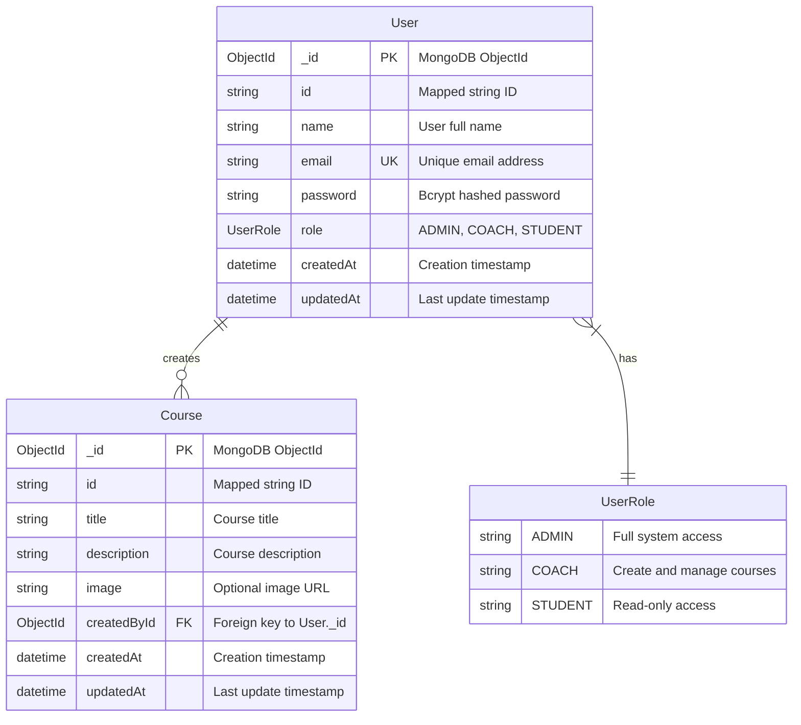

# Entity Relationship Diagram (ERD) - MongoDB with Prisma

## Database Schema Overview

This document describes the MongoDB database schema for the Express Generic Repository API, illustrating the relationships between entities and their attributes using Prisma ORM with MongoDB.

## Entities and Relationships

### User Entity (MongoDB Collection: `users`)

- **Primary Key**: `_id` (ObjectId, MongoDB native)
- **Mapped ID**: `id` (String, exposed to application)
- **Attributes**:
  - `name` (String) - User's full name
  - `email` (String, Unique Index) - User's email address for authentication
  - `password` (String) - Hashed password using bcrypt
  - `role` (UserRole Enum) - User role: ADMIN, COACH, or STUDENT (default: STUDENT)
  - `createdAt` (DateTime) - Record creation timestamp
  - `updatedAt` (DateTime) - Record last update timestamp (auto-managed)

### Course Entity (MongoDB Collection: `courses`)

- **Primary Key**: `_id` (ObjectId, MongoDB native)
- **Mapped ID**: `id` (String, exposed to application)
- **Attributes**:
  - `title` (String) - Course title
  - `description` (String) - Detailed course description
  - `image` (String, Optional) - Course image URL
  - `createdById` (ObjectId) - References User.\_id
  - `createdAt` (DateTime) - Record creation timestamp
  - `updatedAt` (DateTime) - Record last update timestamp (auto-managed)

### UserRole Enum

- `ADMIN` - Full system access and user management
- `COACH` - Can create and manage own courses
- `STUDENT` - Read-only access to courses

## MongoDB-Specific Features

### ObjectId Benefits

- **Global Uniqueness**: No need for auto-increment or UUIDs
- **Timestamp Embedded**: Creation time embedded in ObjectId
- **Distributed-Friendly**: No coordination needed across servers
- **Sortable**: Natural sorting by creation time

### Document Structure

```javascript
// User Document Example
{
  "_id": ObjectId("65f7a1b2c3d4e5f6a7b8c9d0"),
  "name": "John Doe",
  "email": "john@example.com",
  "password": "$2b$10$...", // bcrypt hash
  "role": "COACH",
  "createdAt": ISODate("2024-03-17T10:30:00.000Z"),
  "updatedAt": ISODate("2024-03-17T10:30:00.000Z")
}

// Course Document Example
{
  "_id": ObjectId("65f7a1b2c3d4e5f6a7b8c9d1"),
  "title": "JavaScript Fundamentals",
  "description": "Learn the basics of JavaScript programming",
  "image": "https://example.com/js-course.jpg",
  "createdById": ObjectId("65f7a1b2c3d4e5f6a7b8c9d0"),
  "createdAt": ISODate("2024-03-17T11:00:00.000Z"),
  "updatedAt": ISODate("2024-03-17T11:00:00.000Z")
}
```

## Relationships

### User → Course (One-to-Many)

- **Relationship Type**: One-to-Many
- **Description**: A User can create multiple Courses
- **Implementation**:
  - Foreign Key: `Course.createdById` references `User._id`
  - Prisma Relation: Virtual field `User.courses` (not stored in document)
  - Cascade Rule: ON DELETE CASCADE (when a user is deleted, their courses are also deleted)

## ERD Diagram (Enhanced Mermaid)



## Database Indexes

### Automatic Indexes (MongoDB)

- `User._id` - Primary key index (automatic)
- `Course._id` - Primary key index (automatic)

### Custom Indexes (Prisma-managed)

- `User.email` - Unique index for email uniqueness
- `Course.createdById` - Index for efficient user-course lookups

### Performance Optimization Indexes (Recommended)

```javascript
// Additional indexes for better performance
db.users.createIndex({ email: 1 }); // Login queries
db.users.createIndex({ role: 1 }); // Role-based queries
db.courses.createIndex({ createdById: 1 }); // User's courses
db.courses.createIndex({ title: "text" }); // Text search
db.courses.createIndex({ createdAt: -1 }); // Latest courses
```

## MongoDB Advantages Over Relational Databases

### Schema Flexibility

- **Dynamic Fields**: Can add new fields without migrations
- **Nested Objects**: Can store complex data structures
- **Arrays**: Native support for arrays and embedded documents

### Performance Benefits

- **Document Retrieval**: Single query for related data
- **Horizontal Scaling**: Built-in sharding support
- **Memory Efficiency**: Efficient binary storage (BSON)

### Development Speed

- **No Migrations**: Schema changes don't require migrations
- **JSON-like**: Natural fit for JavaScript/TypeScript applications
- **Aggregation Pipeline**: Powerful data processing capabilities

## Access Control Rules

### Course Management

- **ADMIN**: Can create, read, update, and delete any course
- **COACH**: Can create courses and manage only their own created courses
- **STUDENT**: Read-only access to all courses

### User Management

- **ADMIN**: Can create COACH users and manage all user accounts
- **COACH/STUDENT**: Can only update their own profile

## Data Validation

### Prisma Schema Validation

```prisma
model User {
  email String @unique  // Ensures unique emails
  role  UserRole @default(STUDENT)  // Default role
}

model Course {
  title       String  // Required field
  description String  // Required field
  image       String? // Optional field
}
```

### Application-Level Validation

- Email format validation using Zod
- Password strength requirements
- Course title length limits
- Image URL format validation

## Backup and Recovery Strategy

### MongoDB Backup Options

- **mongodump**: Full database backup
- **Replica Sets**: Automatic failover and data redundancy
- **Atlas Backup**: Cloud-managed backup service
- **Point-in-Time Recovery**: Continuous backup with Atlas

### Disaster Recovery

- Multiple replica set members
- Geographic distribution
- Automated failover
- Cross-region backups

## Migration from Relational Database

### Key Differences

| Aspect        | Relational (MySQL)                | Document (MongoDB)             |
| ------------- | --------------------------------- | ------------------------------ |
| Schema        | Fixed schema, migrations required | Flexible schema, no migrations |
| Relationships | Foreign keys, JOINs               | Embedded documents, references |
| IDs           | Auto-increment integers           | ObjectIds                      |
| Transactions  | ACID across tables                | ACID within documents          |
| Scaling       | Vertical scaling primary          | Horizontal scaling native      |

### Migration Benefits

- **Faster Development**: No schema migrations
- **Better Performance**: Single document queries
- **Scalability**: Built-in horizontal scaling
- **Flexibility**: Can adapt to changing requirements

## Future Enhancements

### Potential Schema Additions

```prisma
model Course {
  // Current fields...

  // Enhanced fields for future
  tags          String[]        // Course tags array
  level         CourseLevel     // BEGINNER, INTERMEDIATE, ADVANCED
  duration      Int             // Duration in hours
  isPublished   Boolean @default(false)
  publishedAt   DateTime?

  // Embedded objects
  metadata      Json?           // Flexible metadata storage

  // Additional relationships
  enrollments   Enrollment[]    // Student enrollments
  reviews       Review[]        // Course reviews
}

model Enrollment {
  id          String @id @default(auto()) @map("_id") @db.ObjectId
  userId      String @db.ObjectId
  courseId    String @db.ObjectId
  enrolledAt  DateTime @default(now())
  completedAt DateTime?
  progress    Float @default(0) // 0-100 percentage

  user   User   @relation(fields: [userId], references: [id])
  course Course @relation(fields: [courseId], references: [id])
}

model Review {
  id       String @id @default(auto()) @map("_id") @db.ObjectId
  rating   Int    // 1-5 stars
  comment  String?
  userId   String @db.ObjectId
  courseId String @db.ObjectId

  user   User   @relation(fields: [userId], references: [id])
  course Course @relation(fields: [courseId], references: [id])
}
```

### Advanced Features

- Full-text search with MongoDB Atlas Search
- Aggregation pipelines for analytics
- Time-series data for user activity tracking
- Geospatial queries for location-based features

## Conclusion

The MongoDB + Prisma combination provides:

- **Type Safety**: Compile-time type checking with Prisma
- **Performance**: Optimized queries and document-based storage
- **Scalability**: MongoDB's built-in horizontal scaling
- **Developer Experience**: Modern ORM with great tooling
- **Flexibility**: Schema evolution without migrations

This architecture is well-suited for modern applications requiring both reliability and adaptability.
